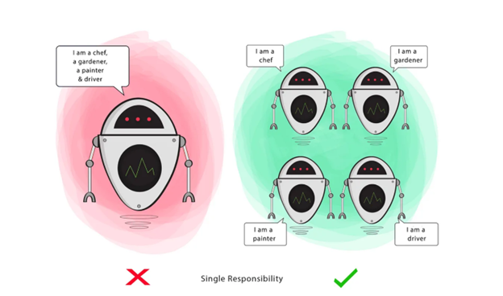
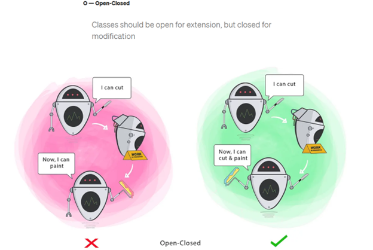
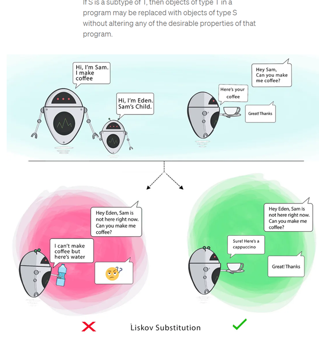
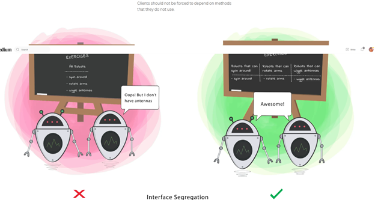
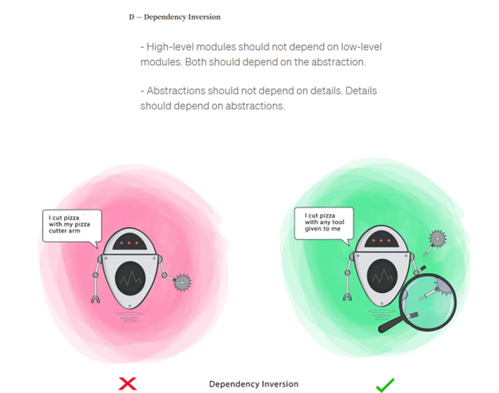

**Low Level Design**

**BASIC OOP Concepts**

**Abstraction**

Abstraction helps to simplify complex systems and focus on the essential features.

In Python, you can achieve abstraction using abstract base classes (ABC) and abstract methods.

[LowLevelDesign/Abstraction.py at master · ajithdevadastech/LowLevelDesign](https://github.com/ajithdevadastech/LowLevelDesign/blob/master/Abstraction.py)

**Encapsulation**

**Encapsulation** is the concept of hiding the implementation details of an object from the outside world and only exposing the necessary information through public methods.

Encapsulation helps protect the object's internal state from external interference and misuse.

In Python, you can achieve encapsulation using private attributes and methods, denoted by a double underscore **prefix (**\__**)**.

[LowLevelDesign/Encapsulation.py at master · ajithdevadastech/LowLevelDesign](https://github.com/ajithdevadastech/LowLevelDesign/blob/master/Encapsulation.py)

**Inheritance**

Inheritance is a mechanism that allows a class to inherit properties and methods from another class, called the superclass or parent class.

The class that inherits is called the subclass or child class.

The child class inherits all the fields and methods of the parent class and can also add new fields and methods or override the ones inherited from the parent class.

Inheritance promotes code reuse and helps create a hierarchical structure.

[LowLevelDesign/Inheritance.py at master · ajithdevadastech/LowLevelDesign](https://github.com/ajithdevadastech/LowLevelDesign/blob/master/Inheritance.py)

**Polymorphism**

Polymorphism is the ability of an object to take on multiple forms.

It enables you to write generic code that can work with objects of multiple types, as long as they share a common interface.

A common way to achieve polymorphism is **method overriding.**

Method overriding is when a subclass provides a specific implementation of a method that is already defined in its parent class.

Method Overloading: <https://github.com/ajithdevadastech/LowLevelDesign/blob/master/Polymorphism-Method%20Overloading.py>

Method Overriding:

[LowLevelDesign/Polymorphism-Method overriding.py at master · ajithdevadastech/LowLevelDesign](https://github.com/ajithdevadastech/LowLevelDesign/blob/master/Polymorphism-Method%20overriding.py)

Operator Overloading:

<https://github.com/ajithdevadastech/LowLevelDesign/blob/master/Polymorphism-Operator%20Overloading.py>

**SOLID Principles**

**S - Single Responsibility**

<https://github.com/ajithdevadastech/LowLevelDesign/tree/master/SOLID%20Principles/Single%20Responsibility>

**O - Open-Closed**

Changing the current behavior of a Class will affect all the systems using that Class.

If you want the Class to perform more functions, the ideal approach is to add to the functions that already exist NOT change them.

Goal

This principle aims to extend a Class’s behavior without changing the existing behavior of that Class. This is to avoid causing bugs wherever the Class is being used.

<https://github.com/ajithdevadastech/LowLevelDesign/tree/master/SOLID%20Principles/Open-Closed>

**L – Liskov Substitution**

When a **child** Class cannot perform the same actions as its **parent** Class, this can cause bugs.

If you have a Class and create another Class from it, it becomes a **parent** and the new Class becomes a **child.** The **child** Class should be able to do everything the **parent** Class can do. This process is called **Inheritance**.

The **child** Class should be able to process the same requests and deliver the same result as the **parent** Class or it could deliver a result that is of the same type.

The picture shows that the **parent** Class delivers Coffee(it could be any type of coffee). It is acceptable for the **child** Class to deliver Cappucino because it is a specific type of Coffee, but it is NOT acceptable to deliver Water.

If the **child** Class doesn’t meet these requirements, it means the **child** Class is changed completely and violates this principle.

**Goal**

This principle aims to enforce consistency so that the parent Class or its child Class can be used in the same way without any errors.

<https://github.com/ajithdevadastech/LowLevelDesign/tree/master/SOLID%20Principles/Liskov%20Substitution>

**I – Interface Segregation**

When a Class is required to perform actions that are not useful, it is wasteful and may produce unexpected bugs if the Class does not have the ability to perform those actions.

A Class should perform only actions that are needed to fulfil its role. Any other action should be removed completely or moved somewhere else if it might be used by another Class in the future.

Goal

This principle aims at splitting a set of actions into smaller sets so that a Class executes ONLY the set of actions it requires.

<https://github.com/ajithdevadastech/LowLevelDesign/tree/master/SOLID%20Principles/Interface%20Segregation%20Principle%20(ISP)>

**D – Dependency Inversion**

Firstly, let’s define the terms used here more simply

High-level Module(or Class): Class that executes an action with a tool.

Low-level Module (or Class): The tool that is needed to execute the action

Abstraction: Represents an interface that connects the two Classes.

Details: How the tool works

This principle says a Class should not be fused with the tool it uses to execute an action. Rather, it should be fused to the interface that will allow the tool to connect to the Class.

It also says that both the Class and the interface should not know how the tool works. However, the tool needs to meet the specification of the interface.

Goal

This principle aims at reducing the dependency of a high-level Class on the low-level Class by introducing an interface.

<https://github.com/ajithdevadastech/LowLevelDesign/tree/master/SOLID%20Principles/Dependency%20Inversion>